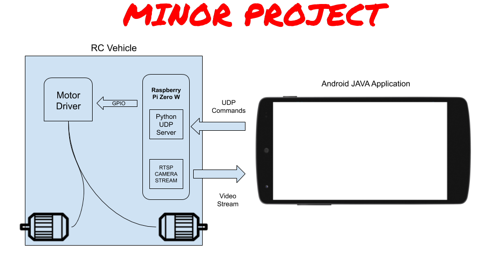

# Engineering ROP Minor Project
### Hunter Ruebsamen

## Project Overview

This is the main repository for my Engineering ROP Minor Project for Mr. Crossett's class.
In this repo, I will include the following components:

1. Source Code for Android Application (Java)
2. Source Code for Raspberry Pi (Python + Shell Script)
3. 3D Design files from Solidworks

