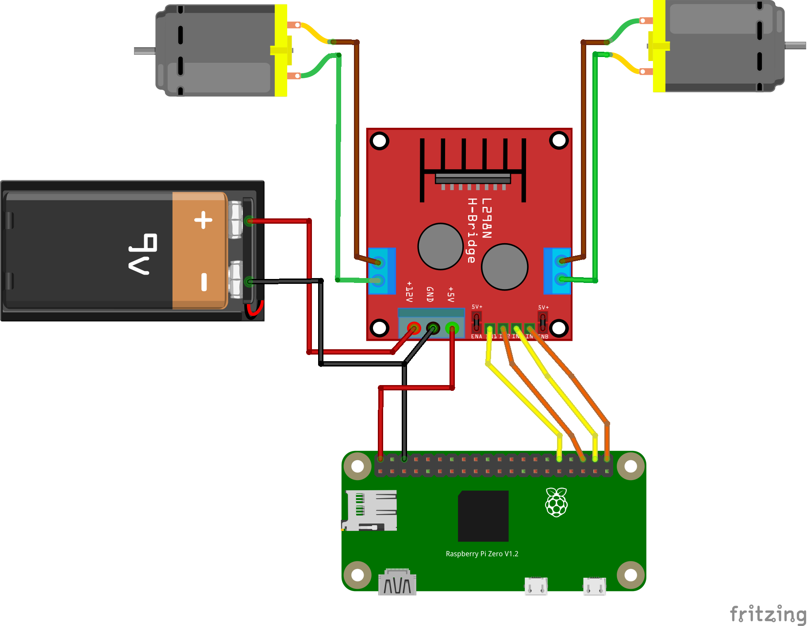

# Engineering ROP Minor Project
## Instructor: Mr. Crossett
### Hunter Ruebsamen

## Project Overview

This is the main repository for my Engineering ROP Minor Project for Mr. Crossett's class.
In this repo, I will include the following components:

1. Source Code for Android Application (Java)
2. Source Code for Raspberry Pi (Python + Shell Script)
3. 3D Design files from Solidworks

### Circuit Diagram
My circuit is real simple, it consists of the following components:
1. Raspberry Pi Zero W
2. L298D Motor Driver Module
3. Raspberry Pi Camera Module (not shown)
4. Two (2) DC Gear Motors with Wheels
5. Battery Power (I'll probably use Lipo)

